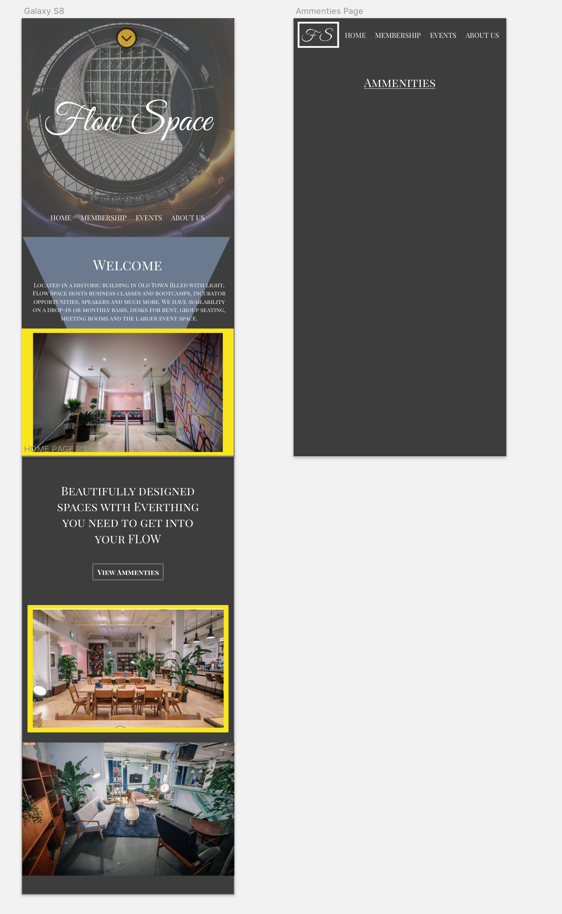

# Coworking Space Project

#### by _**Ward Chamberlain**_

## Description
  Practice using the workflow pattern of User Stories -> Research -> Sketch -> Wireframing -> Prototyping -> Coding to create a client specific Coworking company website to emulate freelance work.

## Setup/Installation Requirements

* Clone or Download from git.
* Open Sketch file in Sketch to view.

Open site using Terminal
  1. Navigate to folder home directory using Terminal  
  2. execute - "npm init"
  3. execute - "npm run build"
  4. execute - "npm run start"
  5. view site in browser

## Known Bugs

No bugs

## Support and contact details

wchamberlain89@gmail.com

## Technologies Used

Sketch  
Webpack  
Sass

## User Stories

#### As the company I want ...
  * A luxurious and modern looking website to show that we cater towards our
  members without holding.

  * The site to feel less corporate and more fun in order to attract members
  that align with our business values and the community we're trying to create.

  * Customers to have an easy time navigating the website so they can find any
  of the information they are looking for quickly.

  * Customers to view our amenities so they can know what we offer and entice them to enroll for membership.

#### As a potential member ...
  * I'd like to be able to easily view pictures of the space, find the location,
  and view pricing. This will allow me to easier make a decision if the workspace
  is for me.

  * I'd like a events section to view upcoming events, so that I can easier make plans to attend.

  #### Non-Tech
    * I'd like to see non-coding related pictures to show that the space is used for all kinds of projects.
    
## User Personas

###Frank
Potential Member - Scanning for information

Needs
-----
Easy access to Membership pricing.
Information on ammenities easy to access or view.
Wants images of the business.

Pain Points
-----------
Unclear membership details
Doesn't want to feel sold to

How to Serve
------------
Membership on homepage and available through main navigation.
Clear ammenities page.
Less blurbs about the company and more information about what they offer.

###Lucy
Potential Member - Artist

Needs
-----
Studio Space for art not computers.
Wants to come for more than just business. 

Pain Points
-----------
Hard to tell who FlowSpace is designed for.
Lack of community to drawn inspiration from.

How to Serve
------------
Section for different community projects.
Pictures that include people.
Way to display the different kinds of workspaces available.

# _Project Photos_

